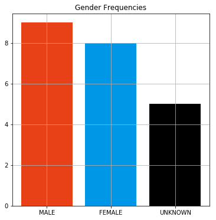
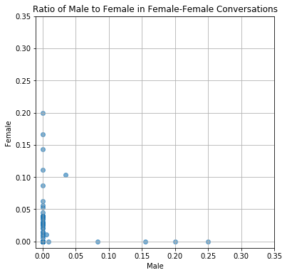
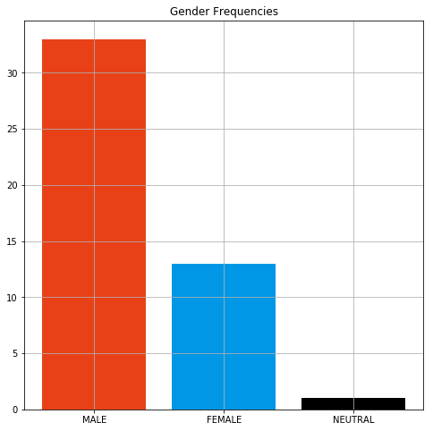
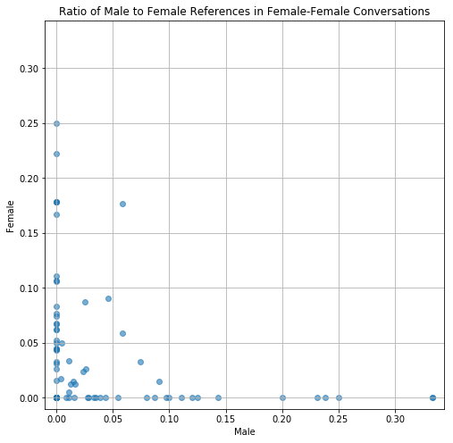
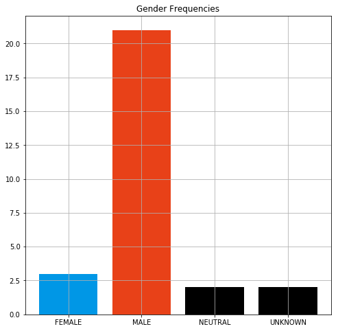
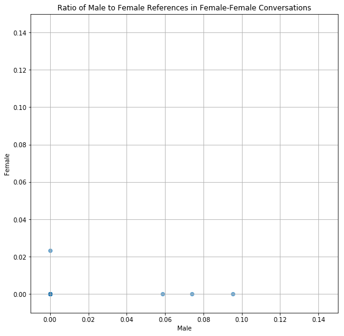
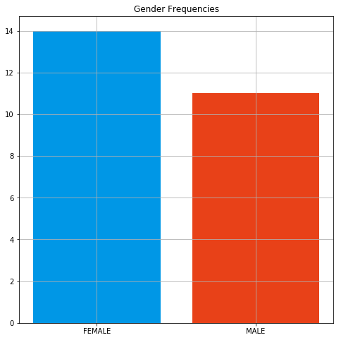
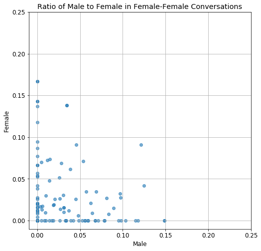

# Data 512: Analyzing 19th Century Literature w.r.t. the Bechdel Test

Assignment repository for DATA 512: Final Project

## Introduction

This repository contains a set of notebooks and reports regarding the analysis of popular 19th century literature in the context of the [Bechdel test](https://en.wikipedia.org/wiki/Bechdel_test). The results of the analyses are summarized [below](results-summary). It also showcases the gaps present in state-of-the-art NLP that hinder us from performing such analyses at scale.

### Approach

**1. Qualitative**

This repository consists of a "thick" [7], qualitative analysis of select novels. This implies that the results may not be statistically significant, and cannot be generalized to the author, genre or era.

**2. Speculative [8]**

Instead of making a strong conclusion about whether or not a novel passes the Bechdel test, this repository only presents the necessary context, numbers and visualizations related to the test, and lets the reader decide whether or not they find the results satisfactory.

## Reproducibility

While each independent notebook is completely reproducible, due to the qualitative nature of the analyses, it is not possible to replicate the research as is for any arbitrary novel. Instead, it is advisable to use the template notebook in the repository and modify it iteratively and interactively, to suit the novel at hand.


## Data

Since Project Gutenberg does not restrict its data under a license, a few novels are distributed along with this repository, along with their processed versions (required for analysis).

## How To Run For a New Novel

### Prerequisites

1. Python 3.5 or later
2. pip3
3. A machine with at least 8G of RAM
4. Java 7 or above

### Steps

1. Clone this repository:
```
git clone https://github.com/havanagrawal/data-512-final-project.git
```
2. Install the required libraries:
```
pip3 install pandas numpy nltk matplotlib unidecode
```
3. Download and unzip the latest version of Stanford NER from [here](https://nlp.stanford.edu/software/CRF-NER.html#Download)
4. Download a novel from Project Gutenberg in text form, or use one from the [`novels`](./novels) directory in this repository.
5. Use the `convert_novel.py` script to convert the novel into a standard format:
```
python3 convert_novel.py --input-file novels/alice-in-wonderland.txt --output-file alice-in-wonderland-standard.txt
```
Use `python3 convert_novel.py --help` to see the complete capabilities of the script.  
6. Run the Stanford NER program on the processed novel, providing the unzipped Stanford NLP directory's contents as the classpath:
```
java -Xmx10g -cp "stanford-corenlp-full-2018-10-05/*" edu.stanford.nlp.pipeline.StanfordCoreNLP -annotators tokenize,ssplit,pos,lemma,ner,depparse,coref,quote -file novels/alice-in-wonderland-standard.txt -outputFormat json
```
7. Use the [reference report](./Final%20Report.ipynb) to perform the analysis.


## Data Schema

The original data is taken as free-form text files from Project Gutenberg. Since the files are fixed column width, we use a short script to convert them into a readable format.

After running the StanfordNER script, we get a JSON file that contains various analyzed linguistic forms. We use the relevant portions of this JSON file for our analysis.

A small, sample annotated JSON file can be found for [The Red Headed League](./novels/the-red-headed-league.txt) story [here](./annotated/the-red-headed-league.txt.json)

For the purpose of illustration (and in the interest of saving space), a cropped version is shown below:

```json
{
  "docId": "the-red-headed-league.txt",
  "sentences": [
    {
      "index": 0,
      "basicDependencies": [
        {
          "dep": "ROOT",
          "governor": 0,
          "governorGloss": "ROOT",
          "dependent": 3,
          "dependentGloss": "called"
        },
        {
          "dep": "nsubj",
          "governor": 3,
          "governorGloss": "called",
          "dependent": 1,
          "dependentGloss": "I"
        },
        ...
     ]
   }
 ]
 "corefs": {
    "26": [
      {
        "id": 17,
        "text": "the room",
        "type": "NOMINAL",
        "number": "SINGULAR",
        "gender": "NEUTRAL",
        "animacy": "INANIMATE",
        "startIndex": 19,
        "endIndex": 21,
        "headIndex": 20,
        "sentNum": 2,
        "position": [
          2,
          9
        ],
        "isRepresentativeMention": false
      },
      ...
    ],
    ...
  }
  "quotes": [
    ...
    {
      "id": 0,
      "text": "“You could not possibly have come at a better time, my dear Watson,”",
      "beginIndex": 327,
      "endIndex": 395,
      "beginToken": 66,
      "endToken": 82,
      "beginSentence": 2,
      "endSentence": 2,
      "speaker": "Unknown",
      "canonicalSpeaker": "Sherlock Holmes"
    },
    {
      "id": 1,
      "text": "“I was afraid that you were engaged.”",
      "beginIndex": 416,
      "endIndex": 453,
      "beginToken": 87,
      "endToken": 96,
      "beginSentence": 3,
      "endSentence": 3,
      "speaker": "Watson",
      "canonicalSpeaker": "Watson"
    },
    {
      "id": 2,
      "text": "“So I am. Very much so.”",
      "beginIndex": 455,
      "endIndex": 479,
      "beginToken": 97,
      "endToken": 106,
      "beginSentence": 4,
      "endSentence": 5,
      "speaker": "Wilson",
      "canonicalSpeaker": "Sherlock Holmes"
    },
    ...
  ],
} 
```

## Results Summary

In this repository, 4 novels are qualitatively analyzed w.r.t. the test. These novels are selected such that they span varying genres, authors, central themes and narrative styles.

The graph on the left is a simple histogram of the genders of characters. It should be noted that gender recognition is a challenging task, especially without context, and so a generous error rate (say 10-20%) should be accounted for.

The graph on the right plots each conversation between two women as a data point. The x-axis represents the fraction of words in the conversation that refer to men, while the y-axis represents the fraction of words in the conversation that refer to women.

| Novel              | Gender Ratios | Conversations |  
|--------------------|---------------|---------------|  
|Alice in Wonderland | | |  
|Great Expectations  | | |
|Hamlet              | | |
|Pride and Prejudice | | |

## References

1. [Women better represented in Victorian novels than modern](https://www.theguardian.com/books/2018/feb/19/women-better-represented-in-victorian-novels-than-modern-finds-study)
2. [Why Diverse Fiction Matters](https://www.tckpublishing.com/why-diverse-fiction-matters/)
3. [Why We Need Diverse YA Books That Represent Marginalized Characters In All Of Their Complex, Quirky Glory](https://www.bustle.com/p/why-we-need-diverse-ya-books-that-represent-marginalized-characters-in-all-of-their-complex-quirky-glory-8003404)  
4. [This is Why We Need Diversity in Fiction](https://katetilton.com/diversity-fiction/)
5. [Automating The Bechdel-Wallace Test](http://nht.ecs.soton.ac.uk/2011/papers/12-flawrence.pdf)
6. [Key Female Characters in Film Have More to Talk About Besides Men: Automating the Bechdel Test](http://aclweb.org/anthology/N/N15/N15-1084.pdf)
7. [Why Big Data Needs Thick Data](https://medium.com/ethnography-matters/why-big-data-needs-thick-data-b4b3e75e3d7)
8. [Towards Human-Centered Algorithm Design](https://journals.sagepub.com/doi/pdf/10.1177/2053951717718854)

## License

1. This repository and its contents are distributed under an open MIT License
2. Project Gutenberg opens its data to any form of commercial and non-commercial use, which is summarized [here](https://www.gutenberg.org/wiki/Gutenberg:Permission_How-To)
